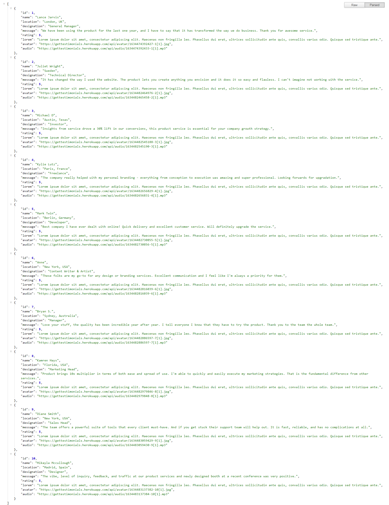

# Testimonials API 

**Authors :** 
- Parshuram Nikam
- Deep Lahane
- Sanjivani Singh
- Sukriti Singh
- Shreya Tandale
---

> Get list of random user Testimonial data.

Tired of copy and pasting lorem user's testimonial text which doesn't give the feel of authenticity, don't worry try testimonial API to get dummy testimonial data that includes :

* User ID
* Name
* Location
* Designation
* Message
* Lorem text
* Avatar
* Rating
* Audio

---

### Contain upto 10 users data, simple use a GET HTTP request on the link. Individual of one data can be fetch using respective ID.





## Get single user testimonial

Based on ID from 1 to 10 get a particular user data. Note here odd ID are male person testimonial data while even ID are female testimonial data. Below is exmaple of fetching the first user data.

;

## API implementation


---

## Installation 

#### Download/clone project

```bash
git clone https://github.com/parshuramnikam/get-testimonials-api.git
```

#### Install Dependancies
After cloning/downloading the source code, change directory to project folder ( project root folder ). 
Run following command: 
```bash
npm install
```
This command will install all the required dependancies.

#### Setup Environment
Create a new file called `.env`  <br/>
Copy all the content from `.env.example` and paste it into `.env` <br/>
Change **CONN_URL** to yours db connection URL & 
you can also change **API_KEY**. 

#### Run the server
```bash
npm run dev
# or
yarn dev
```

Congratulations 🎊🎉
